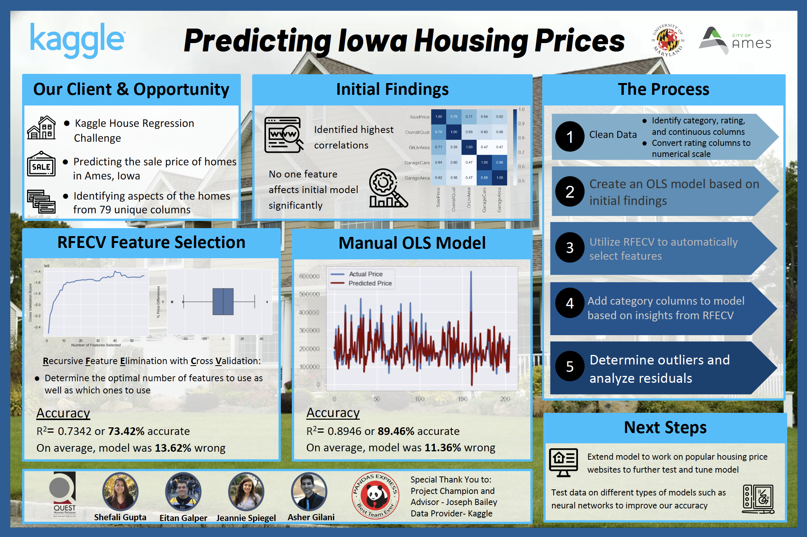

# Kaggle House Regression Challenge
This is the "Pandas Express" submission for the **Kaggle House Prices: Advanced Regression Techniques Challenge** as part of the BMGT438A data science class.

## Final Video Presentation
Final presentation including analysis can be viewed here:

## Final Poster

## Methodology
1. Clean up the data by turning all of the categorical columns (e.g Neighborhood) into a format an ML model can read using pd.get_dummies()
2. Create an initial OLS (**O**rdinary **L**east **S**quares) model to see its r^2 value and see whether there are any other problems with the data
3. Make use of SKlearn's automated feature selection package by using RFECV (**R**ecursive **F**eature **S**election with **C**ross **V**alidation) to recursively determine the number of features to use in the final model as well as what those features are
4. Explore SKlearn's Univariate Automated Feature Selection to see if it performs better than RFECV
5. Build the final model and analyze the residuals to look for outliers and see if there are any patterns in the model's inaccuracies
6. Run the final model on the test dataset to predict prices needed for the final Kaggle submission
